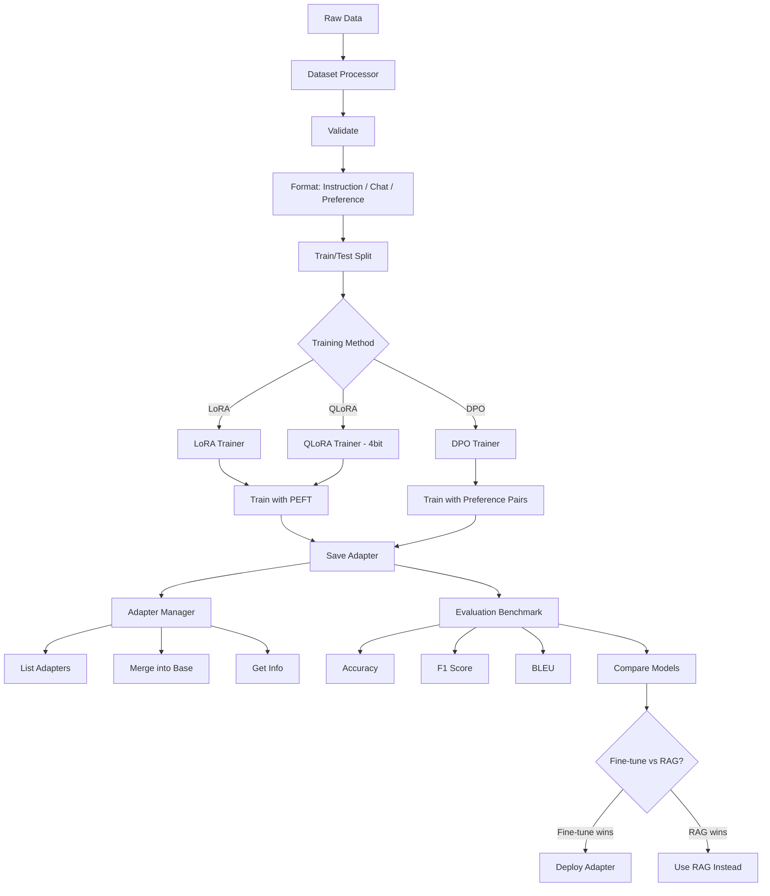

# AI GenAI Fine-Tuning

LLM fine-tuning framework with LoRA, QLoRA, DPO, dataset preparation, evaluation benchmarks, and adapter management.

## Objectives

- Understand the end-to-end workflow of fine-tuning large language models from dataset preparation through deployment
- Apply Low-Rank Adaptation (LoRA) to efficiently train adapter layers on top of frozen pretrained models
- Use QLoRA with 4-bit quantization to fine-tune large models on consumer-grade hardware with limited VRAM
- Implement Direct Preference Optimization (DPO) for aligning model outputs with human preferences without a separate reward model
- Design and validate fine-tuning datasets including instruction, chat, and preference pair formats with proper train/test splits
- Evaluate fine-tuned models using standardized benchmarks including accuracy, F1 score, and BLEU metrics
- Manage the adapter lifecycle including listing, inspecting, merging adapters into base models, and versioning
- Compare fine-tuning versus retrieval-augmented generation (RAG) approaches to determine the optimal strategy for a given use case
- Build a production-ready REST API for orchestrating fine-tuning jobs, running evaluations, and serving adapter metadata
- Deploy fine-tuned models using containerized environments with GPU support via Docker and docker-compose

## Table of Contents

1. [Overview](#overview)
2. [Project Structure](#project-structure)
3. [Fine-Tuning Methods](#fine-tuning-methods)
4. [Deployment](#deployment)
5. [API Reference](#api-reference)
6. [Testing](#testing)

---

## End-to-End Flow



---

## Overview

| Component | Description |
|-----------|-------------|
| LoRA Trainer | Low-Rank Adaptation — train small matrices on frozen base |
| QLoRA Trainer | 4-bit quantized base + LoRA for memory efficiency |
| DPO Trainer | Direct Preference Optimization without reward model |
| Dataset Processor | Format conversion, validation, train/test split |
| Benchmark | Compare fine-tuned vs base vs prompted (accuracy, F1, BLEU) |
| Adapter Manager | List, merge, inspect saved adapters |

---

## Fine-Tuning Methods

| Method | Memory | Quality | Best For |
|--------|--------|---------|----------|
| LoRA | ~16GB VRAM (8B model) | Near full-finetune | General fine-tuning |
| QLoRA | ~6GB VRAM (8B model) | Slightly lower | Consumer hardware |
| DPO | ~16GB VRAM | Alignment focused | Preference alignment |

---

## Project Structure

```
ai-genai-finetuning/
├── src/finetuning/
│   ├── api/router.py            # REST API
│   ├── config/settings.py       # Configuration
│   ├── models/schemas.py        # Job, dataset, eval models
│   ├── trainers/
│   │   ├── lora_trainer.py      # LoRA fine-tuning
│   │   ├── qlora_trainer.py     # QLoRA (4-bit) fine-tuning
│   │   └── dpo_trainer.py       # DPO preference training
│   ├── datasets/processor.py    # Data preparation
│   ├── evaluation/benchmark.py  # Model comparison
│   ├── adapters/manager.py      # Adapter lifecycle
│   └── main.py
├── tests/
├── config/
├── pyproject.toml
├── Dockerfile
└── docker-compose.yml
```

---

## Deployment

```bash
poetry install
cp .env.example .env
poetry run python -m uvicorn finetuning.main:app --reload --port 8000
poetry run pytest
docker-compose up --build  # Requires NVIDIA GPU
```

---

## API Reference

| Method | Endpoint | Description |
|--------|----------|-------------|
| POST | /api/v1/finetuning/jobs/lora | Create LoRA job |
| POST | /api/v1/finetuning/jobs/qlora | Create QLoRA job |
| POST | /api/v1/finetuning/jobs/dpo | Create DPO job |
| POST | /api/v1/finetuning/evaluate | Run benchmark |
| GET | /api/v1/finetuning/evaluate/compare | Compare models |
| GET | /api/v1/finetuning/adapters | List adapters |
| GET | /api/v1/finetuning/health | Health check |

---

## Testing

```bash
poetry run pytest --cov=src/finetuning --cov-report=term-missing
```
